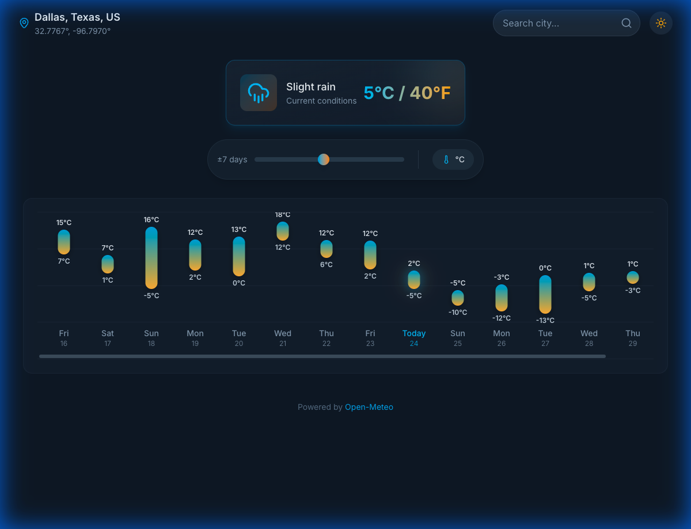
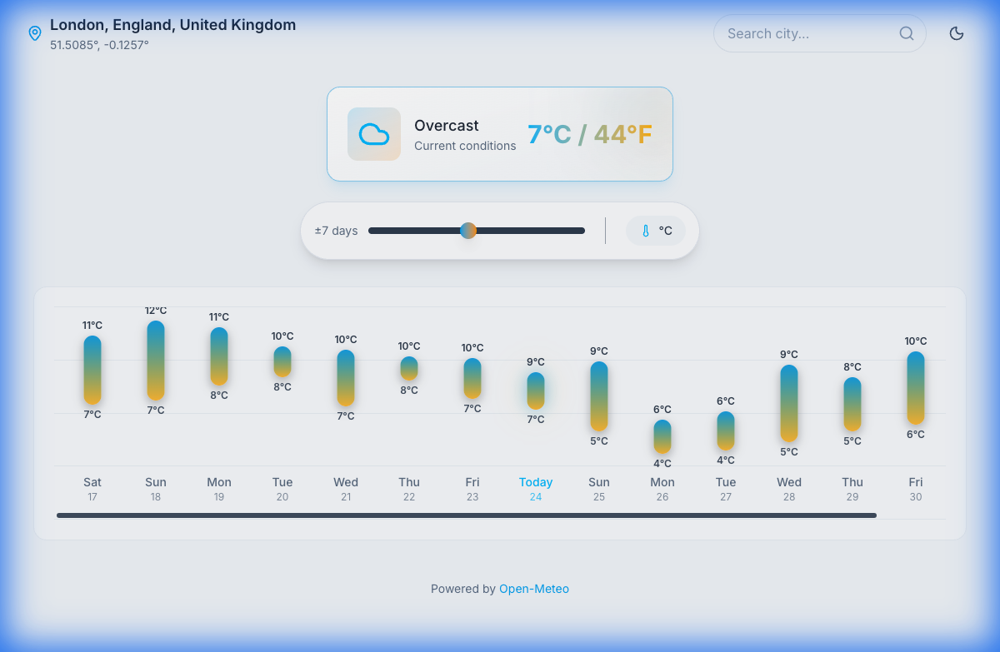

# Minimal Weather

A beautiful, minimalistic weather dashboard that visualizes daily temperature ranges using floating vertical bars, allowing users to explore past and future weather trends fluidly.

<p align="center">
  
  &nbsp; &nbsp;
  
</p>

## Features

- **Dynamic Temperature Chart**: Visualizes daily min/max temperatures with gradient vertical bars.
- **Interactive Controls**: 
  - Drag the slider to adjust the forecast range (up to 14 days).
  - Toggle between Celsius (°C) and Fahrenheit (°F).
  - Switch between Dark and Light themes.
- **Smart Location**:
  - Auto-detects your location on startup.
  - Search for any city worldwide with instant geocoding.
  - Displays readable city names (e.g., "London, UK") instead of coordinates.
  - **State Persistence**: Remembers your city, unit preference, and days range across sessions.
  - **Manual Refresh**: Instantly update weather data with the refresh button.
- **Current Conditions**: Floating card showing current weather, icon, and dual-temperature display.
- **Responsive Design**: Works beautifully on desktop, tablet, and mobile.
- **iOS Ready**: Built with Capacitor for native iOS deployment.

## Tech Stack

- **Frontend**: React 18 + Vite
- **Styling**: Tailwind CSS v4
- **Icons**: Lucide React
- **Mobile**: Capacitor (iOS)
- **Data**: [Open-Meteo API](https://open-meteo.com/) (Weather) + BigDataCloud (Reverse Geocoding)

## Google Antigravity Experiment

This project was built as an experiment using **Google Antigravity**, an advanced agentic coding assistant.

### Experiment Highlights
- **Agentic Workflow**: The entire application, from project scaffolding to iOS deployment configuration, was driven by the Antigravity agent.
- **Iterative Refinement**: The agent self-corrected issues (e.g., fixing date calculations, improving UI labels) based on visual verification and user feedback.
- **Full Stack Capabilities**: The agent handled:
  - React/Vite setup
  - Complex CSS/Tailwind styling
  - API integration logic
  - Native iOS configuration via Capacitor
  - Documentation and testing

## Future Enhancements

- **UI/UX Improvements**:
  - Create a more user-friendly and visually appealing interface.
  - Include dark mode support.
  - Add weather animations (e.g., rain, snow, and sunshine effects).
  
## Getting Started

### Prerequisites
- Node.js (v18+)
- Xcode (for iOS dev)

### Installation

```bash
# Clone the repository
git clone <your-repo-url>
cd weather-app

# Install dependencies
npm install
```

### Running for Web

```bash
# Start development server
npm run dev
```
Open http://localhost:5173 to view it in the browser.

### Building for iOS

```bash
# Build the web assets
npm run build

# Sync with Capacitor
npx cap sync ios

# Open in Xcode
npx cap open ios
```
In Xcode, select your connected iPhone or a simulator and press **Cmd+R** to run.

## License

[MIT](LICENSE)
